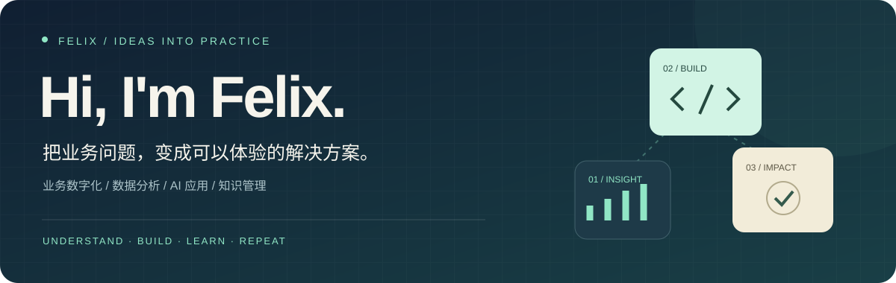

  

  <strong>从业务出发，用数据理解问题，用 AI 和工具实现想法。</strong>

  <a href="#实践中的三个方向">近期实践</a> ·
  <a href="#我如何推进一个想法">工作方式</a> ·
  <a href="#更多关于我">关于我</a>

---

我关注业务数字化、数据分析与 AI 应用。喜欢把复杂流程梳理清楚，把想法做成可以体验、讨论和持续改进的工具，也用 Obsidian 与 GitHub 沉淀实践中的思考。

## 实践中的三个方向

<table>
<tr>
<td width="33%" valign="top">

### 01 · 交互原型
**让需求变得可体验**

把业务流程转化为 HTML 页面，通过实际操作讨论需求、调整交互。

业务梳理 · HTML · 交互设计

</td>
<td width="33%" valign="top">

### 02 · 数据分析
**让判断有据可依**

探索经营诊断与分析模型，从指标变化中理解问题，寻找改进方向。

指标体系 · 经营诊断 · 分析模型

</td>
<td width="33%" valign="top">

### 03 · 自动化实践
**让更新更顺畅**

将 GitHub Actions 与 Cloudflare Pages 串联，让网页随代码更新自动发布。

GitHub Actions · Cloudflare Pages

</td>
</tr>
</table>

## 我如何推进一个想法

**理解问题 → 梳理流程 → 数据验证 → 原型实现 → 持续迭代**

先弄清楚要解决什么，再选择合适的工具。每次实践，也尽量留下可复用的文档、方法与经验。

## 更多关于我

<strong>展开查看 · 关注的方向与日常工具</strong>

 

| 方向 | 我在关注什么 |
| :--- | :--- |
| 业务数字化 | 业务流程、运营指标，以及跨平台协作 |
| 数据分析 | 经营诊断与分析模型，用数据支持判断 |
| AI 应用 | 需求分析、交互原型与日常工作自动化 |
| 知识管理 | 用 Obsidian 与 GitHub 记录思考、积累经验 |

正在探索从 **业务文档 → 数据分析 → 工具实现** 的完整工作流程。

 

  <strong>保持好奇，持续动手。</strong> 
  欢迎交流业务分析、AI 应用与知识管理。

